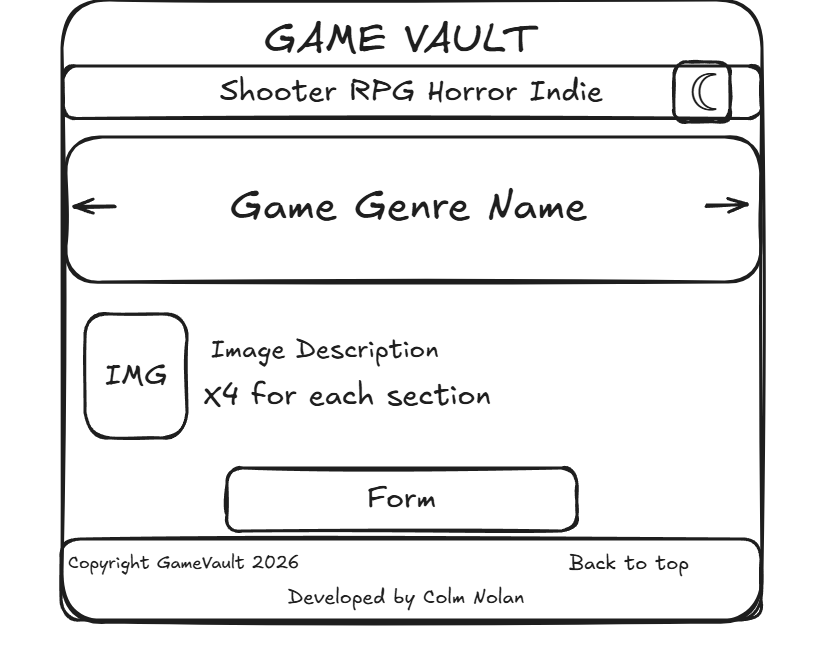

# Project Concept

I'm passionate about video games and wanted to create GameVault — a web project that explores the genres I love. By building this interactive guide covering Shooter, RPG, Horror, and Indie games, I can showcase my interest in gaming while demonstrating my web development skills. The goal is to create an engaging resource that helps other gamers discover and understand what makes each genre unique.

## Project Structure

This is how I will structure my one-page website:

1. **Header (with navigation + dark mode toggle)**  
	I will include the site logo/name and a navigation menu for quick section links. I will place the dark mode toggle in the nav so users can switch between light and dark themes at any time.

2. **Carousel hero**  
	I will create a carousel hero that displays only the genre name and a game image of my choosing from that genre as the background. I will include slider arrows and dot indicators to show which slide the user is on.

3. **Shooter section**  
	I will feature popular shooter games as clickable image cards. Each card will include the game image (with hover effects), and the game information (title, release date, and external game info link) will be shown beside or under the image card.

4. **RPG section**  
	I will follow the same layout as the Shooter section, featuring RPG games.

5. **Horror section**  
	I will follow the same layout as the Shooter section, featuring horror games.

6. **Indie section**  
	I will follow the same layout as the Shooter section, featuring indie games.

7. **Newsletter form**  
	I will add a newsletter form with name and email. I will use JavaScript regex-based form validation to show a success or error message after submission.

8. **Footer**  
	I will include copyright text, a back-to-top link, and a credit to myself in the footer.

## Wireframe

