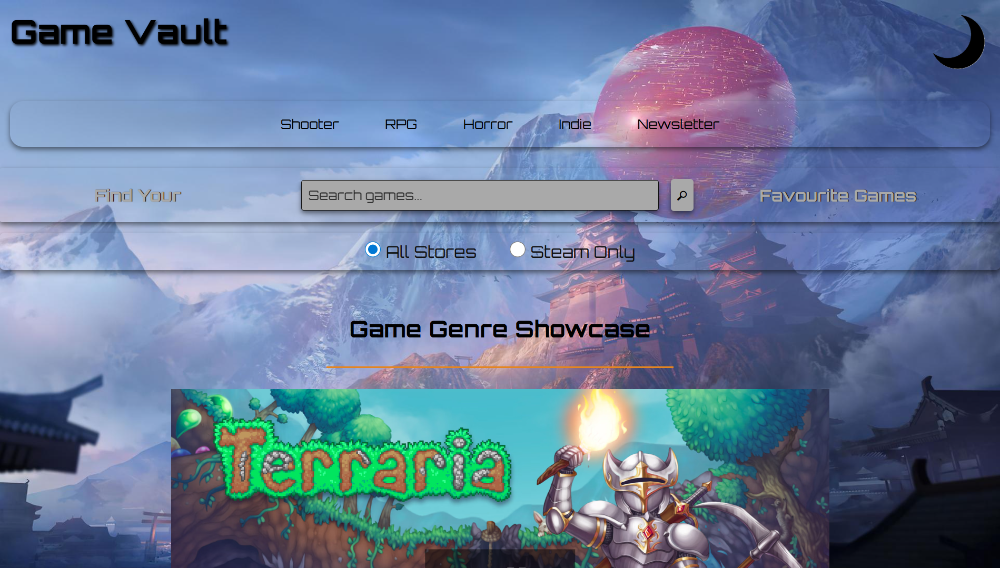
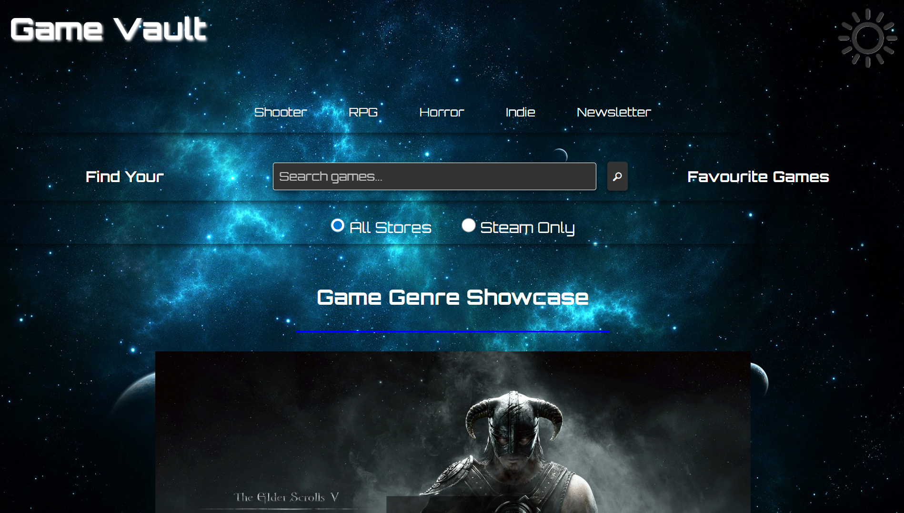

# GameVault – Video Game Genre Encyclopedia

**GitHub Repository:**

https://github.com/ColmN-Dev/GameVault

**Public URL:**

https://colmn-dev.github.io/GameVault/

**Vercel:**

https://game-vault-cnd.vercel.app/

---

## Project Description/Concept

For this project, I built **GameVault**, a single-page application that showcases four curated video game genres — Shooter, RPG, Horror, and Indie — each featuring three selected games. 

Users can explore genres, search for game deals using the CheapShark REST API, and filter results by store. The application also includes dark mode, a genre filter dropdown, and an interactive carousel displaying all twelve games.

---

## Features

* Auto-rotating genre carousel with manual navigation and pause-on-hover
* Genre filter dropdown to display all or selected genres
* Four curated genre sections with game information and store links
* Carousel interaction that scrolls to and highlights corresponding genre sections
* Game deal search using the CheapShark REST API (top 12 results displayed)
* Store filter to toggle between all stores and Steam results
* Dark mode toggle with persistent state
* Newsletter signup form with validation and feedback messages
* Browser History API support for navigation
* Fully responsive design across mobile, tablet, and desktop
* Smooth scrolling navigation
* PWA support via web app manifest
* Open Graph meta tags for social sharing
* Modular JavaScript structure (`dark-mode.js`, `carousel.js`, `form.js`, `filter.js`, `search.js`)

---

## Tech Stack

* **HTML** – semantic structure  
* **CSS** – layout, styling, responsiveness, dark mode  
* **JavaScript** – interactivity, DOM manipulation, API integration  

---

## Role of JavaScript

JavaScript is what makes the site actually interactive rather than just a static layout. It handles user input, updates content dynamically, and controls features like the carousel, filters, and search results.

---

## JavaScript Interactivity

JavaScript is used throughout the project to add dynamic functionality, including:

- DOM manipulation to update search results and show/hide genre sections  
- Event handling for clicks, form submission, dropdown changes, and hover interactions  
- API integration using `fetch()` and `async/await` to retrieve game deals  
- Timers (`setInterval`, `setTimeout`) to control carousel behaviour and animations  
- Form validation with real-time feedback messages  

---

## Design Decisions

The application uses a gaming-focused aesthetic with an orange (light mode) and blue (dark mode) colour scheme. The Orbitron font was chosen for its arcade-style appearance. Space-themed banner images are used for genre cards, with different background images for light and dark modes.

The carousel was designed to display all twelve games, grouped into four categories with navigation dots representing each genre rather than individual slides. This keeps the interface clean while maintaining usability.

Additional filters were implemented to give users more control over what content is displayed. Full development details are documented in `Documentation.md`.

---

## Wireframes

Wireframes were created at the start of development to plan layout and structure.


---

## Testing

A comprehensive set of tests was conducted, including Lighthouse audits for performance, accessibility, best practices, and SEO. All tests were run in **incognito mode** to ensure accurate, cache-free results.

### Lighthouse Results (incognito mode)

| Hosting        | Performance | Accessibility | Best Practices | SEO |
|----------------|-------------|---------------|----------------|-----|
| GitHub Pages   | 100         | 100           | 100            | 100 |
| Vercel         | 99          | 100           | 100            | 100 |

Earlier performance issues (score of 91) were improved through image optimisation.

### Additional Testing

| Test | Result |
|------|--------|
| Responsive design across mobile, tablet, laptop, desktop | Pass |
| Dark mode across all elements | Pass |
| Form validation (valid and invalid inputs) | Pass |
| CheapShark API search (valid and empty input) | Pass |
| Store filter functionality | Pass |
| Carousel auto-rotation and manual navigation | Pass |
| Back button behaviour (mobile) | Pass |

Initial Biome linting reported 5 errors and 12 warnings. All issues were resolved.

### Biome Linting Output

Final linting run after resolving all issues:

```

$ npx @biomejs/biome lint --max-diagnostics 100
Checked 8 files in 35ms. No fixes applied.

```


---

## Issues

| Title                      | Severity | Description |
|----------------------------|----------|-------------|
| Genre card scale animation | Low      | Genre cards were too large to scale up effectively during carousel-triggered animations. Scaling up caused layout issues, so the animation was adjusted to scale down instead for a cleaner visual effect. |
| Performance optimisation   | Low      | Full-page background images and carousel assets impacted performance. Images were compressed, but further optimisation could improve load times. |

---

## Future Work

* Improve accessibility with keyboard navigation and ARIA labels  
* Refactor components using JavaScript classes (OOP)  
* Add pagination or “load more” functionality for search results  

---

## Author

Colm Nolan / ColmN-Dev

---

## Webpage Preview – Light Mode


---

## Webpage Preview – Dark Mode


---