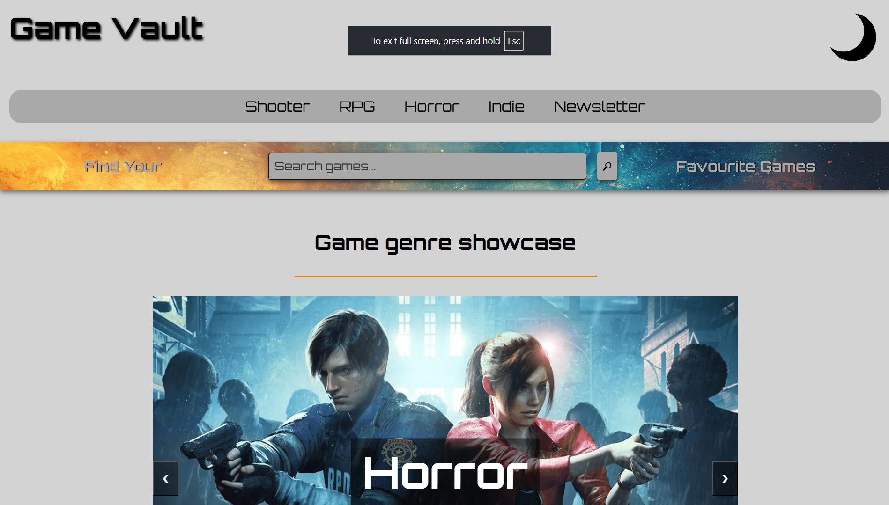
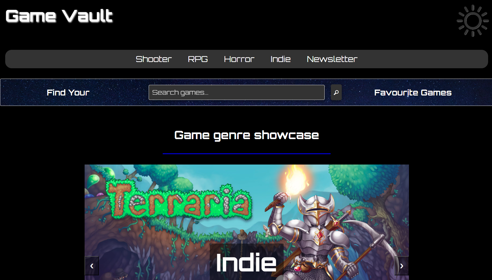

# GameVault – Video Game Genre Encyclopedia

This project is a single-page application built with HTML, CSS, and JavaScript for **GameVault**, a video game genre encyclopedia covering Shooter, RPG, Horror, and Indie games.  
It was created as part of a college assignment to demonstrate front-end development, interactivity, and JavaScript functionality.

🔗 Live site:  
https://colmn-dev.github.io/GameVault/

---

## Tech Stack

- **HTML** – semantic single-page structure  
- **CSS** – layout, styling, and responsive design  
- **JavaScript** – interactivity and DOM manipulation  

---

## Features

- Interactive genre carousel
- Four genre sections with game images and external links
- Dark mode toggle
- Newsletter signup form with JavaScript validation
- Responsive design

---

## Notes

This site is a **static front-end project only**.  
No backend or database is included as this was outside the scope of the assignment.

---

## Author
Colm Nolan/ColmN-Dev

---

## Webpage Preview Lightmode

---

## Webpage Preview Darkmode

